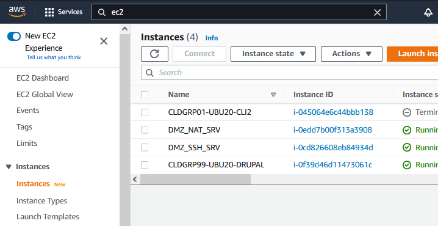

# C0 - Part I - AWS Management Console

### Prerequisites

* Get the credentials (see your dev ops teams channel in teams).
* Change (first login) password
* Select the eu-south-1 region

### How to...

#### **EC2**

* List, start, stop, terminate instances ?
* List, add update Security Groups  ?
* List, generate, download keypair ?

#### VPC

* List, Associate, Update a Subnet
* List, add update route in Route table

