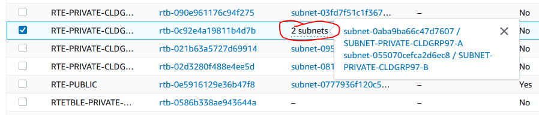

# C2 - Part I - Migration

### Prerequisites

* [Challenge 01](../challenge-01/)
* Set a drupal instance in the CLD-VPC-LAB001
* VPC Labo 02 is ready to be used. Please refer to [Infra Labo 02](infra-labo-02.md#infra-diagram), except for your own private instance.

### Challenge


Do not change anything on VPC level, as well as the DMZ!&#x20;



Check if subnet A is available in az 1a and subnet B in az 1b !!!! &#x20;


#### Step 1 - Create an AMI of your Drupal Instance

Constraints:&#x20;

* AMI Name - CLDGRPXX\__Labo02\_Migration_\_\[Free]

```
[Request]
//TODO

[Response]
//TODO
```

#### Step 2 - Deploy a new instance, based on your AIM previously created in the new VPC.

Constraints:

|                  |                                                                 |
| ---------------- | --------------------------------------------------------------- |
| Instance Name    | CLDGRP\[XX]\__Drupal_\_\[FREE]                                  |
| Instance Type    | t3.micro                                                        |
| OS Volume        | 10 Go                                                           |
| Region           | Please refer to [Infra Labo 02](infra-labo-02.md#infra-diagram) |
| VPC              | Please refer to [Infra Labo 02](infra-labo-02.md#infra-diagram) |
| Subnet           | Please refer to [Infra Labo 02](infra-labo-02.md#infra-diagram) |
| Private IP       | Please refer to [Infra Labo 02](infra-labo-02.md#infra-diagram) |
| SSH Key Pair     | Same as in VPC LAB 01                                           |
| Security (group) | SG-CDGP\[XX]-LABO02                                             |

```
[Request]
//TODO

[Response]
//TODO
```

#### Step 3 - Terminate your "old" Drupal Instance hosted in VPC-Labo01 &#x20;

```
[Request]
//TODO

[Response]
//TODO
```

#### Step 4 - Clean all Items used for experimental purpose (Key Pair, Security Group)

```
[Request]
//TODO

[Response]
//TODO
```

#### Step 5 - In the VPC Labo 01, remove Your Private Subnet (with Route table and routes)

```
[Request]
//TODO

[Response]
//TODO
```

Step 6 - Finalize your LABO02 environment

* You need to "link" your two new subnet route tables (A and B) to your subnet.



* Update the route table to enable outbound traffic

