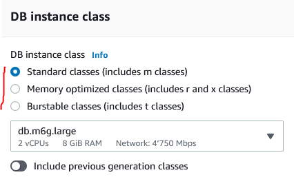
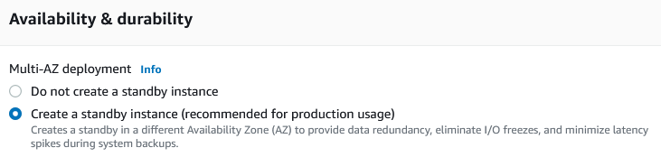

# C2 - RDS - 2tiers

## Create and migrate a database using the Relational Database Service (RDS)

****[**AWS Official Doc**](https://aws.amazon.com/rds/)****

## Prerequisites

* [ ] Create an AMI of your Drupal Instance (CLD-INSTANCE-DEVTEAM\[XX])
* [ ] Terminate your instance
* [ ] Delete your private subnet
* [ ] Create two new subnets sharing the ip range like this
  * [ ] 10.0.\[XX].0/28 -> eu-south-1a -> CLD-SUBNET-DEVTEAM\[XX]\_A
  * [ ] 10.0.\[XX].128/28 -> eu-south-1b -> CLD-SUBNET-DEVTEAM\[XX]\_B

### **Step 1: Create DB subnet group**

* Subnet group details

| Variable    | Value                     |
| ----------- | ------------------------- |
| Name        | CLD-DBSUBNET-DEVTEAM\[XX] |
| Description | CLD-DBSUBNET-DEVTEAM\[XX] |
| VPC         | CLD-VPC                   |

* Add subnets

| Variable          | Value                                                                                   |
| ----------------- | --------------------------------------------------------------------------------------- |
| Availabilily zone | eu-south-1a + eu-south-1b                                                               |
| Subnets           | <ul><li>10.0.[XX].0/28 -> eu-south-1a</li><li>10.0.[XX].128/28 -> eu-south-1b</li></ul> |

### **Step 2: Create a new security group for the RDS instance**

| Rule                 | Value                                                                                              |
| -------------------- | -------------------------------------------------------------------------------------------------- |
| Rule for SQL Traffic | <ul><li>Port range: 3306</li><li>Protocol: TCP</li><li>Source: Private Subnet e-south-1a</li></ul> |

### **Step 3: Create a database**


**This step will be performed by AWS Console.**\
****\
**Issue 1: no way  to specify the template with the CLI (prod/dev)**

**Issue 2: accessibility problem for the sql user created with the CLI.**


| Variable               | Value                                                                                                                                                                                         |
| ---------------------- | --------------------------------------------------------------------------------------------------------------------------------------------------------------------------------------------- |
| Engine                 | Please refer to your Drupal version                                                                                                                                                           |
| Template               | Dev / Test                                                                                                                                                                                    |
| DB instance identifier | DBINS-CLDGRP\[XX]-RDS-DRUPAL                                                                                                                                                                  |
| DB User                | admin                                                                                                                                                                                         |
| DB Password            | \[pwd]                                                                                                                                                                                        |
| DB instance class      | <ul><li>Burstable classes</li><li>db.t3.micro</li></ul>                                                                                                                                       |
| Storage                | <ul><li>Storage type: General Purpose (SSD)</li><li>Allocated Storage: 20 GB</li><li>Storage Autoscalling: unchecked</li></ul>                                                                |
| Connectivity           | <ul><li>VPC: VPC-CLD-LABO02</li><li>Subnet Group: The one created just before</li><li>Public access: No</li><li>VPC security group: use existing</li><li>Availability zone : A Zone</li></ul> |
| Additionnal option     | Disable autobackup                                                                                                                                                                            |

### **Step 4: Test connection**

* Get the rds endpoint
* Test that the drupal machine can connect to the RDS with the command:

```
mysql --host=endpoint_address --user=<rds_master_username> --password=<rds_master_password>`
If you have a prompt with `mysql>` it means that it worked
```

### **Step 5: Migrate DB**

* (In prod, you should inform end user for maintenance)
* Clean active sessions
* Connect to the database and create the database and a new user (rds\_admin pahX2dVhrLRncD)

```sql
CREATE DATABASE drupal;
CREATE USER 'rds_admin'@'%' IDENTIFIED BY '<rds_admin_password>';
GRANT SELECT, INSERT, UPDATE, DELETE, CREATE, DROP, INDEX, ALTER, CREATE TEMPORARY TABLES, LOCK TABLES ON drupal.* TO 'rds_admin'@'%';
```

* Disconnect from rds and use this command to migrate data from local database to the rds

```shell
mysqldump --add-drop-table --no-tablespaces --user=drupal --password=<mysql_local_password> drupal | mysql --host=endpoint_address --user=<rds_admin_password> --password=<rds_admin_password> drupal
```

* Edit the database settings in file `/var/www/html/drupal/sites/default/settings.php`

### **Step 6 : Create a custom virtual machine image**

* In the EC2 console bring up the Instances panel and select the Drupal master instance.
* Bring up the context menu and select Image > Create Image. Provide the following answers (leave any field not mentioned at its default value):
* Image Name: CLDGRPXX-RDS-DRUPAL-AMI.
* Image Description: Drupal connected to RDS database.
* Click Create Image. The instance will shut down temporarily and the image will be created.

### Conceptual aspects

Question 1 - Standard vs Memory-optimized vs Burstable?



Question 2 - What's a Standby instance?



Question 3 - How to prove the correct operation of the RDS?
