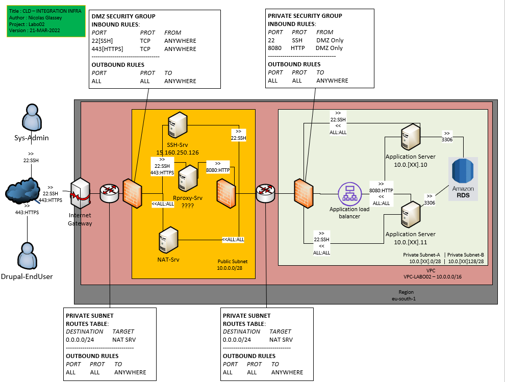

# Infra Labo 02


### Infra Diagram



### Create VPC

* Create VPC

```
[Request]
aws ec2 create-vpc --cidr-block 10.0.0.0/16 --tag-specifications ResourceType=vpc,Tags=[{Key=Name,Value=VPC-CLD-LAB02}] --region eu-south-1

[Response]
{
    "Vpc": {
        "CidrBlock": "10.0.0.0/16",
        "DhcpOptionsId": "dopt-1b957672",
        "State": "pending",
        "VpcId": "vpc-0f30ae553472a3709",
        "OwnerId": "709024702237",
        "InstanceTenancy": "default",
        "Ipv6CidrBlockAssociationSet": [],
        "CidrBlockAssociationSet": [
            {
                "AssociationId": "vpc-cidr-assoc-02f560a8ec6559a7f",
                "CidrBlock": "10.0.0.0/16",
                "CidrBlockState": {
                    "State": "associated"
                }
            }
        ],
        "IsDefault": false,
        "Tags": [
            {
                "Key": "Name",
                "Value": "VPC-CLD-LAB02"
            }
        ]
    }
}
```

* Create Internet gateway (create and attach)

```
[Request]
aws ec2 create-internet-gateway --tag-specifications ResourceType=internet-gateway,Tags=[{Key=Name,Value=IGW-CLD-LABO02}] --region eu-south-1

[Response]
{
    "InternetGateway": {
        "Attachments": [],
        "InternetGatewayId": "igw-04a1a09f8c8014591",
        "OwnerId": "709024702237",
        "Tags": [
            {
                "Key": "Name",
                "Value": "IGW-CLD-LABO02"
            }
        ]
    }
}
```

```
aws ec2 attach-internet-gateway --internet-gateway-id igw-04a1a09f8c8014591 --vpc-id vpc-0f30ae553472a3709 --region eu-south-1
```

### Create Subnets - DMZ

* Public Subnet - DMZ

```
[Request]
aws ec2 create-subnet --vpc-id vpc-0f30ae553472a3709 --cidr-block 10.0.0.0/28 --tag-specifications ResourceType=subnet,Tags=[{Key=Name,Value=SUBNET-PUBLIC-CLD-LABO02}] --region eu-south-1

[Response]
{
    "Subnet": {
        "AvailabilityZone": "eu-south-1a",
        "AvailabilityZoneId": "eus1-az1",
        "AvailableIpAddressCount": 11,
        "CidrBlock": "10.0.0.0/28",
        [...]
        "PrivateDnsNameOptionsOnLaunch": {
        "HostnameType": "ip-name",
        "EnableResourceNameDnsARecord": false,
        "EnableResourceNameDnsAAAARecord": false
        }
    }
}
```

* Main subnet

```
[Request]
aws ec2 create-subnet --vpc-id vpc-0f30ae553472a3709 --cidr-block 10.0.99.0/28 --tag-specifications ResourceType=subnet,Tags=[{Key=Name,Value=SUBNET-PRIVATE-CLDGRP99-MAIN}] --region eu-south-1

[Response]
//See above (same command))
```

* Subnet specific for Elastic Capabilities

```
[Request]
aws ec2 create-subnet --vpc-id vpc-0f30ae553472a3709 --cidr-block 10.0.99.0/28 --tag-specifications ResourceType=subnet,Tags=[{Key=Name,Value=SUBNET-PRIVATE-CLDGRP99-ELASTIC}] --region eu-south-1

[Response]
//See above (same command)
```

### Set routes and reachability

* Deploy NAT instances

//TODO add security group + key pair

```
[Request]
aws ec2 run-instances --subnet-id subnet-0d0cbb5c80ca9ea69 --image-id ami-02a4de0b012aaf518 --instance-type t3.nano --key-name DMZ_NAT_INSTANCE --private-ip 10.0.0.10 --tag-specifications ResourceType=instance,Tags=[{Key=Name,Value=DMZ_NAT_SRV_LABO02}] --region eu-south-1
[Response]
{
    "Groups": [],
    "Instances": [
        {
            "AmiLaunchIndex": 0,
            "ImageId": "ami-02a4de0b012aaf518",
            "InstanceId": "i-048bfa8eef98db1f7",
            "InstanceType": "t3.nano",
            "KeyName": "DMZ_NAT_INSTANCE",
            [...]
            "PrivateDnsNameOptions": {
                "HostnameType": "ip-name",
                "EnableResourceNameDnsARecord": false,
                "EnableResourceNameDnsAAAARecord": false
            }
        }
    ],
    "OwnerId": "709024702237",
    "ReservationId": "r-0accd85a58ecdda1c"
}
```

* Disable destination/source check

```
[Request]
aws ec2 modify-instance-attribute --instance-id=i-048bfa8eef98db1f7 --no-source-dest-check
[Response]
none
```

* Get Ip address

```
[Request]
aws ec2 allocate-address --tag-specifications ResourceType=elastic-ip,Tags=[{Key=Name,Value=IP-DMZ-NAT-SRV-LABO02}] --region eu-south-1
[Response]
{
    "PublicIp": "15.160.73.0",
    "AllocationId": "eipalloc-08b0ccbaf918e7a73",
    "PublicIpv4Pool": "amazon",
    "NetworkBorderGroup": "eu-south-1",
    "Domain": "vpc"
}
```

* Attach Ip address

```
[Request]
aws ec2 associate-address --instance-id=i-048bfa8eef98db1f7 --allocation-id eipalloc-08b0ccbaf918e7a73 --region eu-south-1
[Response]
{
    "AssociationId": "eipassoc-0328446976cf64a5f"
}
```

* Create route tables

**Public Route Table**

```
[Request]
aws ec2 create-route-table --vpc-id vpc-0f30ae553472a3709 --tag-specifications ResourceType=route-table,Tags=[{Key=Name,Value=RTETBLE-PUBLIC-LABO02}] --region eu-south-1

[Response]
{
    "RouteTable": {
        "Associations": [],
        "PropagatingVgws": [],
        "RouteTableId": "rtb-038e3c989cc8b43cc",
        "Routes": [
            {
                "DestinationCidrBlock": "10.0.0.0/16",
                "GatewayId": "local",
                "Origin": "CreateRouteTable",
                "State": "active"
            }
        ],
        "Tags": [
            {
                "Key": "Name",
                "Value": "RTETBLE-PRIVATE-CLDGRP99-MAIN"
            }
        ],
        "VpcId": "vpc-0f30ae553472a3709",
        "OwnerId": "709024702237"
    }
}
```

**Private Route Table**

```
[Request]
aws ec2 create-route-table --vpc-id vpc-0f30ae553472a3709 --tag-specifications ResourceType=route-table,Tags=[{Key=Name,Value=RTETBLE-PRIVATE-CLDGRP99-MAIN}] --region eu-south-1
[Response]
See above (same command)
```

* Update routes table

**Public routes (to internet gateway)**

```
[Request]
aws ec2 create-route --route-table-id rtb-0f2c2408347ba33fc --destination-cidr-block 0.0.0.0/0 --gateway-id igw-04a1a09f8c8014591 --region eu-south-1
[Response]
{
    "Return": true
}
```

**Private routes (to nat instance)**

```
[Request]
aws ec2 create-route --route-table-id rtb-038e3c989cc8b43cc--destination-cidr-block 0.0.0.0/0 --instance-id i-048bfa8eef98db1f7 --region eu-south-1
[Response]
{
    "Return": true
}
```

* Associate Route Table to Subnet

**Association for main subnet**

```
[Request]
aws ec2 associate-route-table --route-table-id rtb-038e3c989cc8b43cc --subnet-id subnet-0692b681f0902eb2a --region eu-south-1
[Response]
{
    "AssociationId": "rtbassoc-0198ac6a66accb037",
    "AssociationState": {
        "State": "associated"
    }
}
```

**Association for elastic subnet**

```
[Request]
aws ec2 associate-route-table --route-table-id rtb-038e3c989cc8b43cc --subnet-id subnet-0692b681f0902eb2a --region eu-south-1
[Response]
{
    "AssociationId": "rtbassoc-0198ac6a66accb037",
    "AssociationState": {
        "State": "associated"
    }
}
```
